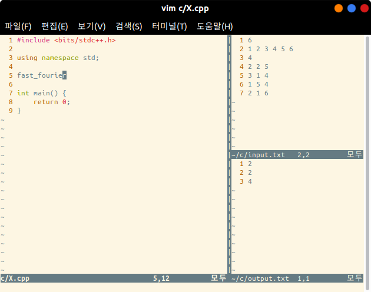
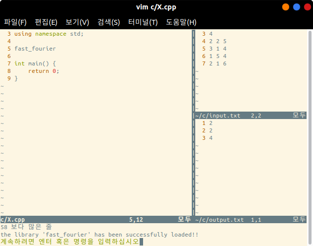
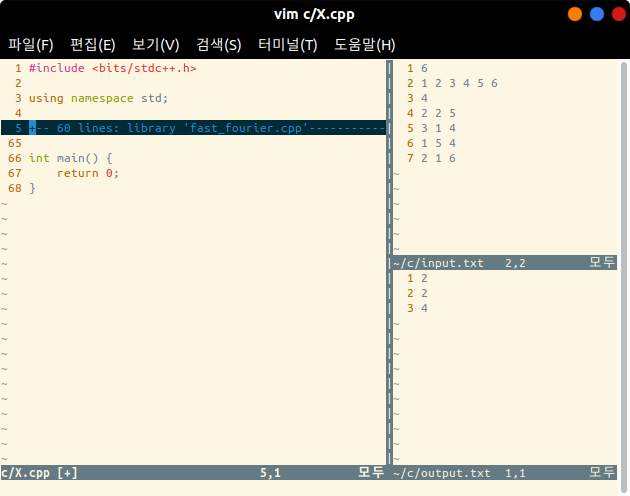

# Competitive Programming Library for Vim

An useful CP library on Vim editor.

I mainly use it for fast programming, and also for handling tricky codes like cycle detection or SCC.

I made it to use by myself. The readability would be poor. I am planning to fix it to be more readable to anyone.

I upload this library to convince that these codes are **all written by myself before the contest.**

- Codeforces or e.t.c.

Korean Explanation: [My Blog Link](https://lego0901.tistory.com/4?category=757500)


## Computer Environment

- OS: Ubuntu 18.04.4 LTS
- Compiler: g++ 7.4.0 with C++17
- Programming: Vim 8.0 on Ubuntu Bash Shell (CUI)
  - Plugin 'VundleVim/Vundle.vim' is installed (But don't need to use on C++)
    - Plugin 'The-NERD-tree' is useful.
- 'vimrc, cvimrc' inside ```/vim``` is located in the home directory, as named '.vimrc, .cvimrc'


## Programming Environment

### Codes, I/O Files Directory Settings

- Every C++ programmings are done inside the directory ```~/c```.
  - Type ```mkdir ~/c``` on your shell to create.
- Default input, output files are ```~/c/input.txt``` and ```~/c/output.txt```.
  - Type ```touch ~/c/input.txt``` and ```touch ~/c/output.txt``` to make them.
- Every .cpp library codes inside ```/library``` on this repository will be located in ```~/c/library/.```
  - Type ```mkdir ~/c/library``` and copy & paste every .cpp code in this repository to the target folder.

In my case, I use the following file hierarchy.

```
home
├── .vimrc
├── .cvimrc
└── c
    ├── A.cpp
    ├── B.cpp
    ├── C.cpp
    ├── D.cpp
    ├── E.cpp
    ├── F.cpp
    ├── G.cpp                         // A to G: Codeforces Problems
    ├── input.txt                     // input file
    ├── output.txt                    // output file
    ├── X.cpp                         // main codes
    └── library                       // library folder
        ├── aho_corasick.cpp
        ├── base.cpp
        ├── binary_indexed_tree.cpp
        ├── bipartite_matching.cpp
        ├── dinic.cpp
        ├── fast_fourier.cpp
        ├── fenwick_tree.cpp
        ├── gauss_elim.cpp
        └── ...
```


### Programming Ways

- I mainly use Ubuntu Bash Shell and CUI Vim on the Terminal.

- Access the programming file on the home directory. For example,

  ```bash
  $ cd ~
  $ vim c/X.cpp
  ```

- Press **[Ctrl + p]** to show I/O files on the right side of the window.

  

- Focus on the main programming file window and press **[Ctrl + o]** to close I/O files.

- Type ```:Base``` to load ```~/c/library/base.cpp``` file.

  - You can edit the base file for your own preference.

- Press **[Ctrl + F5] [Enter]** to compile the .cpp file.

- Press **[Ctrl + F6] [Enter]** to run the compiled file reads input from ```input.txt``` and outputs ```output.txt```.

- Press **[Ctrl + F7] [Enter]** to run the compiled file on the Bash Shell.

- Other key binding are easily implemented on the ```cvimrc``` file.


### Library Loading

- Make sure that your cursor is located in the global variable declaration area. (Not inside a function.)

- Press **[Leader + l]** to see what we have inside the ```~/c/library``` folder.

  - The default **Leader** key is **\\ (backslash)**.

- If you want to load ```fast_fourier.cpp```, then type ```fast_fourier``` correctly on Vim(chop ```.cpp``` part), and press **<Esc>** to exit the Insert mode. And press **[Leader + l]**.

  - Before pressing **[Leader + l]**.

    

  - After pressing **[Leader + l]**.

    

  - Now you can see the folded 60 lines on your file.

    

  - A folded lines can be unfolded by pressing **[Spacebar]**. It can be unfolded by typing **[zc]**.


### Customizing and Creating a Library Code

- There are marks on every library code. For example, on ```union_find.cpp```, 
  - You might see that the ```class union_find``` is wrapped by the marks;
    - ```//////// ---- Woosung Song's Source Code ---- ////////```
  - When you press **[Leader + l]**, the content between the two marks is loaded.
- The mark can be edited on ```.cvimrc```. It is written with Vim-Python script. But I don't recommend to do that because you will have to do so many things to edit them all..


#### Creating a Library Code

- The common structure for every library code is that,

  - It begins with

    ```C++
    #include <bits/stdc++.h>
    
    using namespace std;
    ```

  - Has the start mark with (You can insert it by pressing **[Leader + m]**.)

    ```C++
    //////// ---- Woosung Song's Source Code ---- ////////
    ```

  - Library content wrapped by ```#ifndef```.

    ```C++
    #ifndef UNION_FIND_DEFINED
    class union_find {
        ...
    };
    #endif
    
    #define UNION_FIND_DEFINED
    ```

    - This is crucial to avoid the method overloading problem. (Which is not supported on C++.)

  - The end mark with (You can insert it by pressing **[Leader + m]**.)

    ```C++
    //////// ---- Woosung Song's Source Code ---- ////////
    ```

  - (Optional) The test code.

    ```C++
    int main() {
        union_find uf(10);
        // ... test code ...
    }
    ```

    - The test code will not be added if you import your library. (Since it is not wrapped inside the marks.)

- You can easily add your own library by just keeping the above basic structure.

