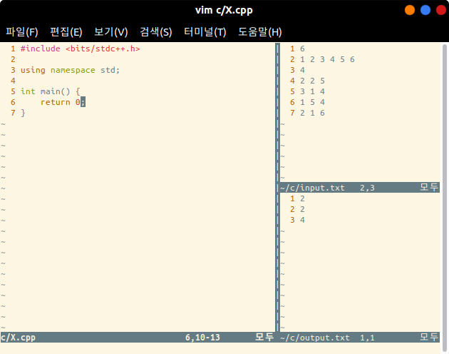

# Competitive Programming Library for Vim

An useful CP library on Vim editor.

I mainly use it for fast programming, and also for handling tricky codes like cycle detection or SCC.

I made it to use by myself. The readability would be poor.

I upload this library to declare that these codes are **written by myself before the contest.**

- Codeforces or e.t.c.


## Computer Environment

- OS: Ubuntu 18.04.4 LTS
- Compiler: g++ 7.4.0 with C++17
- Programming: Vim 8.0 on Ubuntu Bash Shell
  - Plugin 'VundleVim/Vundle.vim' is installed (But don't need to use on C++)
    - Plugin 'The-NERD-tree' is useful.
- 'vimrc, cvimrc' inside ```/vim``` is located in the home directory, as named '.vimrc, .cvimrc'


## Programming Environment

#### Codes, I/O Files Directory Settings

- Every C++ programmings are done inside the directory ```~/c```.
  - Type ```mkdir ~/c``` on your shell to create.
- Default input, output files are ```~/c/input.txt``` and ```~/c/output.txt```.
  - Type ```touch ~/c/input.txt``` and ```touch ~/c/output.txt``` to make them.
- Every .cpp library codes inside ```/library``` on this repository will be located in ```~/c/library/.```
  - Type ```mkdir ~/c/library``` and copy & paste every .cpp code in this repository to the target folder.

In my case, I use the following file hierarchy.

```
home
└── c
    ├── A.cpp
    ├── B.cpp
    ├── C.cpp
    ├── D.cpp
    ├── E.cpp
    ├── F.cpp
    ├── G.cpp                         // A to G: Codeforces Problems
    ├── input.txt                     // input file
    ├── output.txt                    // output file
    ├── X.cpp                         // main codes
    └── library                       // library folder
        ├── aho_corasick.cpp
        ├── base.cpp
        ├── binary_indexed_tree.cpp
        ├── bipartite_matching.cpp
        ├── dinic.cpp
        ├── fast_fourier.cpp
        ├── fenwick_tree.cpp
        ├── gauss_elim.cpp
        └── ...
```


#### Programming Ways

- I mainly use Ubuntu Bash Shell and CUI Vim on the Terminal.

- Access the programming file on the home directory. For example,

  ```bash
  $ cd ~
  $ vim c/X.cpp
  ```

- Press **<Ctrl + p>** to show I/O files on the right side of the window.

  

- 

